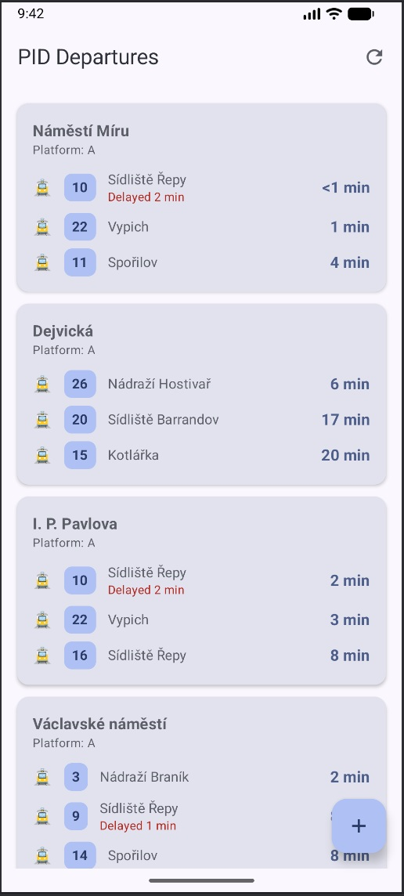
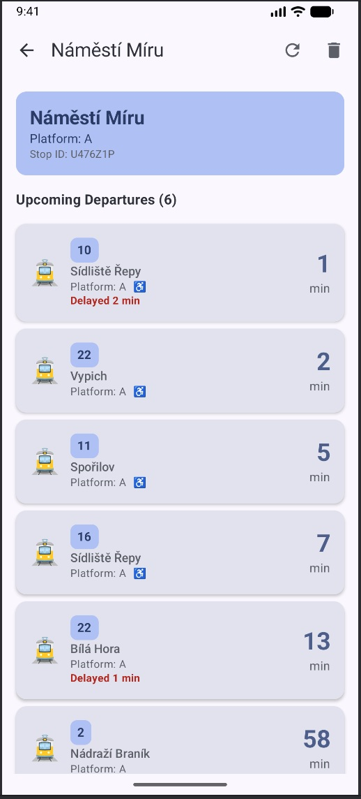

# PID Departures

## To make catching your tram or bus in Prague easier!

Prague Public Transport departure tracking application.
Built using Kotlin, Jetpack Compose, and Golemio Public Transport API.

1) Choose and save your favorite stops.
2) See upcoming departures at a glance on the home screen.
3) Tap a stop for detailed departure information or to remove it from your list.

 

## Setup

### Prerequisites
- Android Studio (latest stable version)
- Android SDK 24+
- Golemio API Key (free registration)

### Installation

1. **Clone the repository**
   ```bash
   git clone https://github.com/knapejar/pid-departures
   cd PIDDepartures
   ```

2. **Get your Golemio API Key**
   - Visit [https://api.golemio.cz/api-keys](https://api.golemio.cz/api-keys)
   - Register for free account
   - Generate an API key

3. **Configure API Key**
   - Copy `local.properties.example` to `local.properties`
   - Open `local.properties` and add your API key:
     ```properties
     GOLEMIO_API_KEY=your_actual_api_key_here
     ```
   - **⚠️ IMPORTANT**: Never commit `local.properties` to version control!

4. **Build and Run**
   - Open project in Android Studio
   - Sync Gradle files
   - Run the app

## Features

- **Home Screen**: Displays saved stops with the next 3 upcoming departures and time in minutes
- **Add Stop**: Select stop, transport type, and direction to track
- **Detail Screen**: Shows up to 10 planned departures for a selected stop with delete option
- **Auto-refresh**: Updates departure data every 60 seconds

## Technical Implementation

### Data Flow
1. User adds stop → Saved to Room DB
2. ViewModel observes DB → Emits Flow of saved stops
3. For each stop → API call every 60s
4. Parse response → Update UI with departures
5. Detail screen → Fetch more departures (limit 10)

### API Integration
- **Endpoint**: `GET /v2/pid/departureboards`
- **Parameters**: 
  - `ids[]`: Stop ID(s)
  - `minutesAfter`: 60
  - `limit`: 3 (home) / 10 (detail)
  - `filter`: routeHeadingOnce
- **Auth**: X-Access-Token header with Golemio API key

### Default Data
- Initial stop: "Anděl" (ASW ID: 1040)

See official Golemio API docs for more details: [https://api.golemio.cz/pid/docs/openapi/](https://api.golemio.cz/pid/docs/openapi/) or [https://api.golemio.cz/docs/public-openapi/](https://api.golemio.cz/docs/public-openapi/) or openapi.json file in the project.
